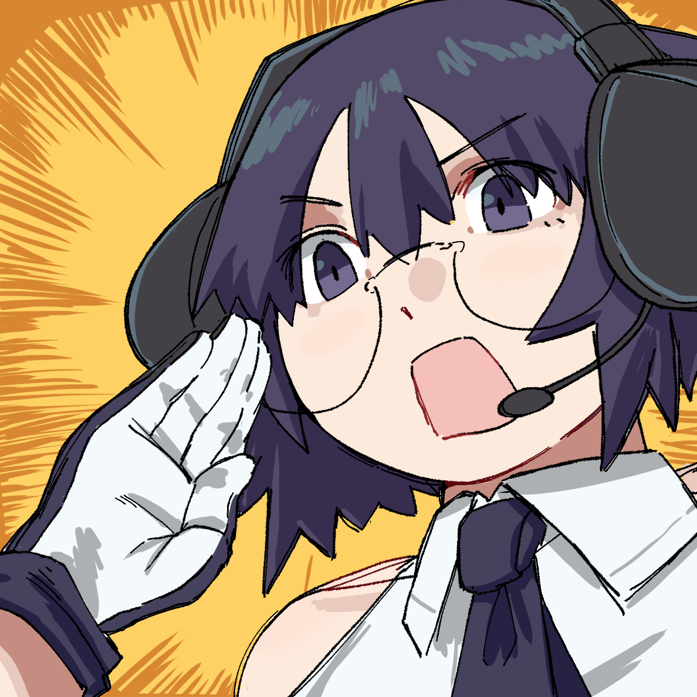
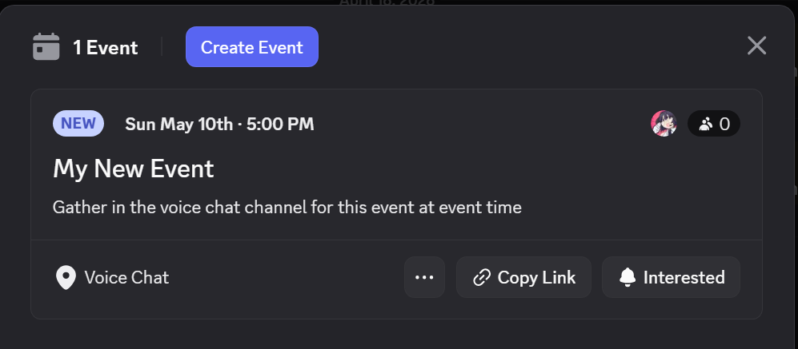

# Meet Adomin! ☆

**Adomi-san** (or **Adomin** for short) is here to help as a Discord event administration assistant. She helps make you manage events organically within Discord, automating work to make events visible, notify event participants, and more! With special training to support FGC tournaments hosted on [start.gg](https://start.gg), she simplifies score reporting while letting you count player check-ins without extra steps in start.gg itself.

You can use the `/help` and `/help-*` commands to get help in Discord, view the [full command reference](commands), and check out the [quick start User Guides](user-guides).

  
  

    
Adomi-san

    <a href="https://discord.com/oauth2/authorize?client_id=1416260932497178644" style="display: inline-block; background: #6366f1; color: #fff; font-weight: 700; font-size: 0.85rem; padding: 0.4rem 1rem; border-radius: 0.5rem; text-decoration: none;">+ Invite to Server</a>
  

## Connecting Systems

Adomin bridges three systems:

| System | Role |
| --- | --- |
| **Discord** | **Main hub.** Creates native Discord Events and lets you manage everything from here |
| **start.gg** | Source for tournament brackets and registered entrants for start.gg netplay tournaments |
| **Google Sheets** | Roster and score matrix for long-term league events (via [fgc-league-sheets](https://github.com/enpicie/fgc-league-sheets)) |

She operates entirely through slash commands in Discord so she can make your existing flow within Discord faster without extra steps.

If you want to get started quickly, [User Guides](user-guides) has instructions built from how enpicie (Adomin's creator) uses Adomin. The rest of the resources on this page are here just to help you better understand how she works, but you can get started just by following one of the guides!

## Events

Adomin's core purpose is helping you coordinate and run online events in Discord, so all events are tied to a Discord event. These are a native feature of Discord and show up at the top of your channel list under "Events".

When you use `/event-create` or `/event-create-startgg`, you'll see a new event appear so people in your server can know what's coming up:

## Leagues

A "League" is a longer-running type of event designed for season-style competitions. [fgc-league-sheets](https://github.com/enpicie/fgc-league-sheets) handles the bulk of the work and uses a Google Sheet as the source-of-truth for all data about players in the league and their scores throughout. **Adomin acts as the bridge from Discord to you Google sheet,** helping with tasks like sign-ups, score reporting, and assigning a role to active participants.

Adomin lets your players report scores and sign up, editing your Google Sheet without requiring people to always contact an organizer for these things. For more information on League-style events, please see the explanation on the [FGC League Template](https://docs.google.com/spreadsheets/d/1FojOkjQJD1dtr29fwH8bgabIdfxd-Yp72V0-pqbIqcc/edit?usp=sharing) sheet.

## Check-in and Registration Tracking

Both Check-in and Registration are not required to be used with events and are features that are here to be used however is convenient for you as an Organizer.

**Check-in tracks who is present for your event, assigning a Participant role on check-in.** Check-In behavior is meant to simulate offline check-in: participants must `/check-in` themselves to affirm their presence and be responsible for themselves during the event. 

**The "Registered" list is only used so Adomin knows who is expected to be present for your event.** If your event was created via `/event-create-startgg` then this list is automatically populated with whoever is registered for the event on start.gg, and that list can be synced any time with `/event-refresh-startgg`.

Imagine this from the perspective of an offline event: Adomin is your assistant and she has a clipboard with a list of everyone registered to be at your event. Participants can come by and sign their names on her check-in sheet. You can ask Adomin any time for who is checked-in, who is registered, and which registered participants have not yet checked in. If needed, she can text each absent registrant to tell them to check-in (`/check-in-list-absent`).

## Permissions and Privileged Commands

To setup Adomin in a server with `setup-server`, you must have Discord's "Manage Server" permission. It's the same permission that lets you change a server's icon.

Any commands that let you manage an event or control anything for other users requires an Organizer role. This is a role you must tell Adomin about when you set things up with `/setup-server`. Adomin checks if someone has that role to count them as an organizer. This cannot be bypassed by Discord permissions.
