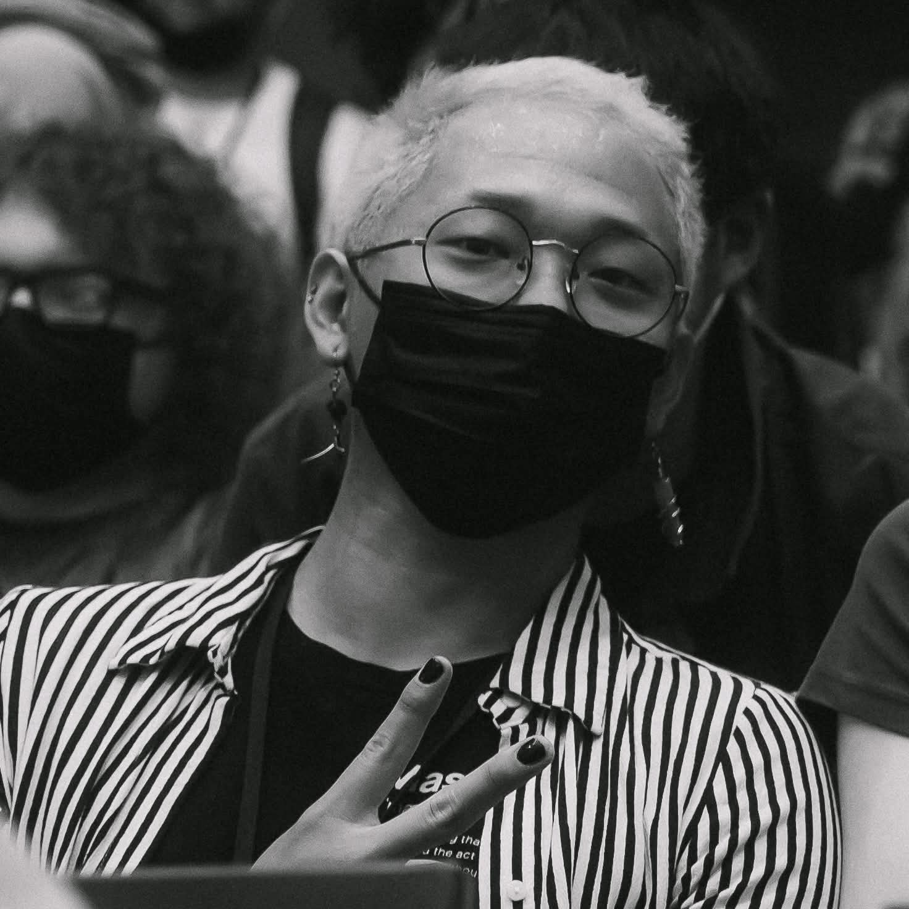

# Notes and Resources

  
  

    
A Note from enpicie

    

        

        These notes are built from my experience as an event organizer both in and outside the FGC and are primarily geared towards FGC event work. Starting Midweek Melting in early 2024 was a daunting endeavor at the time, and my goal here is to empower people to more comfortably approach supporting our less-supported games through online events.
        

        

        I have learned a lot from others in the FGC and aim to share from what has helped me as an organizer thus far. Like playing fighting games, I see organization as a craft to hone. Perhaps more mini blog posts than notes, please remember these are rooted in my opinions and experiences — <em>there is not a "right" way to run an event.</em>
        

    

  

## Beginner Brackets

Who counts as "beginner"? Fighting games are often enjoyed casually and the journey of improvement varies a lot. Beginner events are great for encouraging and developing players, but there are 2 common pitfalls:

1. Beginner standard is set too high or has too many experienced players and truly new players get overwhelmed
2. Players graduate from beginner standard slowly and beginner pool becomes oversaturated

Through running the Melt Your Blood series for MBAACC, I have seen a lot of new players stick with playing Melty and outgrow beginner events. Here is what has helped most:

**Define standards as objectively as possible via bracket results.** Clear results are independent of any personal opinion and reflect visible gameplay success over other players. If a player has cleared a certain threshold, they are no longer a beginner.

**Reward consistent performance**. Sometimes there are cases where someone may have a standout performance but lack consistency. More importantly, however, is when a player is consistently close to clearing a breakout result. Repeatedly achieving strong results can show a ceiling of ability that is higher than many players who can be considered "beginner".

My own take on this can be found in how I implemented the qualifications for my beginner/intermediate "Ascension" bracket series Melt Your Blood. Rules are detailed on the page for [MYB 11](https://www.start.gg/tournament/melt-your-blood-11).

## Scheduling Events

Determining available times for people remotely is incredibly difficult, especially when online events tend to span multiple timezones. Recurring events tend to be more impactful than standalone effects because they become reliable occurrences people can account for. Standalone events have their place but may not always work out for people.

The goal is to make it easier for people to keep track of events so people can plan to participate.

**With recurring events, having a predictable cadence helps.** Chicago locals becoming strictly biweekly made them much easier for me to track and plan around. I run Midweek Meltings first Wednesday of the month for this reason. Hobbies can often be difficult to keep track of when life gets busy, and predictable timings help people keep track of things even when it is difficult.

**For standalone events, it is most important to plan far in advance.** Remembering an individual event can be difficult if you do not often have to. Picking a date early is critical since it gives people time to ensure that those interested in attending have time to ensure they can make it.

## Commentary

Commentators are a core part of any FGC event stream and are ingrained in what first impressions people may get of your game and community. It is important to **develop a foundation of commentators** or have a basis of strong commentators to ask to help with your events.

I share these resources with all Midweek Mashers commentators:
- [Sajam video on commentary fundamentals](https://youtu.be/gu2Pkno7XvA?si=v9ihnTcFIoTOH8jH)
- [My write-up on commentary](https://medium.com/@enpicie/commentary-on-commentary-a2223a893e9f)

The remainder of my thoughts are in the post linked here. If you are building a community, it is valuable to train commentators to be prepared to take the stage at majors and represent your game well.

## Confidence as an Organizer

FGC is at its core a grassroots community, and by now we see the fruit of work by many tenured and skilled organizers: it's easy to be intimidated or feel inadequate.

I was still pretty new when I started Midweek Melting, and my experience since then has taught me that what matters most is that you run events for the love of the game. Events provide something fun for people to participate in. As long as you create an experience you would appreciate as a participant, people will have fun and that's the end goal.

Sincere effort shows.
